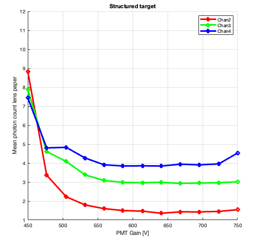
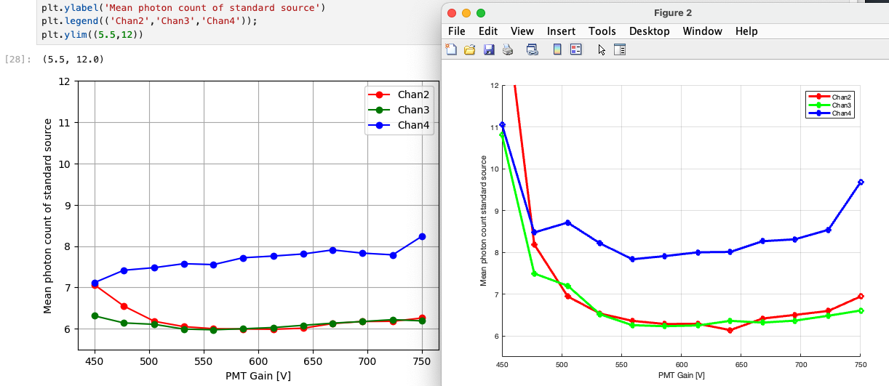

# Converting the standard source to photons

The code shown here runs through all the channels and gains of the structured target data and
generates conversion coefficients for all then applies to the standard source

## Set up
```matlab
% path to the data. This needs to be set to be user
im_path = '/Users/rob/LOCAL/RoCa_2025_Q1_Photon_QC/NeuroVision__2025_01_22';

% Class that finds and serves file names
sss=standardSourceFileServer(im_path);
```


## Run through all structured images

```matlab
ind=1;
gains={};
qSize={};
offsetLevel={};
photons={};
minValues={};

for ii = 2:4
    fprintf('Processing channel %d\n', ii)
    files = sss.get_tiff_files_for_chan(ii);
    [gains{ind},qSize{ind},offsetLevel{ind},photons{ind},minValues{ind}] = get_all_mean_counts(files,false);
    ind=ind+1;
end

gains = cat(1,gains{:});
qSize = cat(1,qSize{:});
offsetLevel = cat(1,offsetLevel{:});
photons= cat(1,photons{:});
minValues = cat(1,minValues{:});
```

## Plot mean photon count of calibration data as a function of PMT gain
```matlab
lineprops={'LineWidth',3};
hold on
plot(gains(1,:),photons(1,:),'ro-',lineprops{:})
plot(gains(2,:),photons(2,:),'go-',lineprops{:})
plot(gains(3,:),photons(3,:),'bo-',lineprops{:})
hold off

grid on
xlabel('PMT Gain [V]')
ylabel('Mean photon count lens paper')
legend('Chan2','Chan3','Chan4');
title('Structured target')
ylim([1,12])
```



# Load standard source data and convert to photons
```matlab
% The relative directory containing the standard source images. No need to edit this
ssDir = 'NeuroVision_standard_light_source_White_2024Q2__2025-01-22_10-20';

ssFiles = dir(fullfile(im_path, ssDir,'*.tif'));
ssFiles = sort({ssFiles.name});

% The standard source images converted to mean photons per pixel
converted_means = zeros(3,length(ssFiles));

G = gains(1,:); % to make code neater later

for ii = 1:length(ssFiles) % Loop over gains (one per file)

    t_file = fullfile(ssDir,ssFiles{ii});

    t_data = stitchit.tools.loadTiffStack(t_file);

    mu = squeeze(mean(t_data(:,:,2:end),[1,2])); % Average of the three channels

    tok=regexp(t_file,'_(\d+)V_','tokens');
    t_gain = str2num(tok{1}{1});

    % Convert each channel to photons
    %  (channel_mean - zero_level- minimum_pixel_value_from_lens_paper) / quantal_size
    offset_corrected_mu= mu - offsetLevel(:,G==t_gain) - minValues(:,G==t_gain);

    photon_converted_mu = offset_corrected_mu ./ qSize(:,G==t_gain);

    converted_means(:,ii) = photon_converted_mu;

end
```

## Plot this
```matlab
%Plot mean photon count of the standard source
lineprops={'LineWidth',3};
hold on
plot(gains(1,:),converted_means(1,:),'ro-',lineprops{:})
plot(gains(2,:),converted_means(2,:),'go-',lineprops{:})
plot(gains(3,:),converted_means(3,:),'bo-',lineprops{:})
hold off
ylim([6,20])
grid on
xlabel('PMT Gain [V]')
ylabel('Mean photon count standard source')
legend('Chan2','Chan3','Chan4');
title('Calibrated standard source')
```


## Quick comparison to Python
Quick and dirty comparison between Python and MATLAB.
The lowest gain looks wrong and there is a bit of blip for blue at 750 V, but otherwise this plot looks reasonable. 
The blue PMT, which we know form the Jupyter notebook has higher intrinsic gain, is slightly shifted towards larger photon values in the MATLAB version. 
The MATLAB data appear less reliable below 500V, but little effort has been made to tweak these fits. 
The red and green PMTs give identical results between Python and MATLAB at gains>500V.


