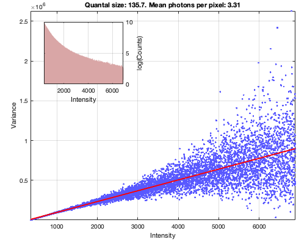
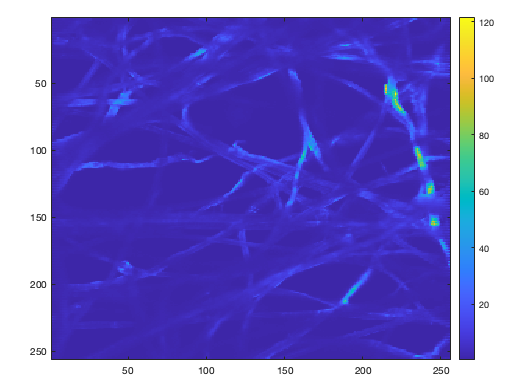

# Demo: converting a lens paper image stack to photons

```matlab
% path to the data. Download raw data from Gin and edit the following line
im_path = '/Users/rob/LOCAL/RoCa_2025_Q1_Photon_QC/NeuroVision__2025_01_22';

% Class that finds and serves file names
sss=standardSourceFileServer(im_path);


% Get all data from channel 3
tiff_files = sss.get_tiff_files_for_chan(3);

% Quickly read and plot some data from a medium gain
% Read the data
ii=8; %just choose an image stack
T = tiffreadVolume(tiff_files{ii});
% Subtract the minimum value
T = T - min(T(:));

% Calculate the intercept and slope of the variance/mean distribution
OUT = compute_sensitivity(T);

```


```matlab
plotPhotonFit(OUT)
```


```matlab
muP = (mean(T,3)-OUT.zero_level)/OUT.quantal_size;
imagesc(muP)
colorbar
```



## See also
* [example_standard_target_calibration.m](example_standard_target_calibration.m)
* [compute_sensitivity.m](compute_sensitivity.m)
